class: center, middle, inverse

# Content

### .boldred[Algal game]

### 利用git实现版本控制

### Markdown写作

### 开源项目

---

class: inverse, center, middle

## PART I: Algal game
## 藻类“游戏/比赛”？

---

class: center, middle, inverse


.footnote[

.bold[Image adapted from]: Pal M, Yesankar P J, Dwivedi A, et al. Biotic control of harmful algal blooms (HABs): A brief review[J]. Journal of Environmental Management, 2020, 268: 110687.

]

---

class: center, middle, inverse

# PART I: Algal game
# 藻类“游戏/比赛”？

.large[

.bold[Article]: Klausmeier C A, Litchman E. Algal games: The vertical distribution of phytoplankton in poorly mixed water columns[J]. Limnology and Oceanography, 2001, 46(8): 1998-2007.

藻类生存.red[博弈]：弱混合水柱中藻类的垂向分布

]

???

美国普林斯顿大学 克劳斯麦尔

---

## 摘要

此处的**game**应当是**Game Theory**（博弈论<sup>[1]</sup>）中的**博弈**的概念：

> 具有竞争或对抗性质的行为称为博弈行为。在这类行为中，参加斗争或竞争的各方各自具有不同的目标或利益。为了达到各自的目标和利益，各方必须考虑对手的各种可能的行动方案，并力图选取对自己最为有利或最为合理的方案。

--

对于在自然界水体中生存的藻类而言，它们通常面临着**两种**基本资源形成鲜明对比的生存困境：

--

- 来自水柱上方的.boldred[光照]；

--

- 通常来自水柱底部（sediment，沉积物）释放的.boldred[营养盐]。

--

当然，除生存所需的资源外，还面对这一些死亡威胁，比如：吃藻的鱼；打捞藻的船师傅；把藻拿去室内做实验的搞科研的人。。。

.footnote[

[1] https://zh.wikipedia.org/wiki/%E5%8D%9A%E5%BC%88%E8%AE%BA

]

---

## 摘要

因此，在弱混合状态的水柱中（密度梯度组织整个水柱的混合或湍流动能的来源较小时）藻类往往呈现非均匀分布的：在水表面、水柱中部或是沉积物表面（水柱底部）形成藻类生物量的高峰，高达水柱中90%的总生物量。这些峰值薄层一般也叫作：

--

+ Surface scums 表层堆积

--

+ Benthic layers 底栖（qi）层

--

+ Deep Chlorophyll maxima （DCM）叶绿素浓度的极大值分布

--

<br>

Chris研究的主要观点为：造成这种垂向分布模式（pattern）的差异主要由**藻类对光照和营养盐的种内竞争（intraspecific competition<sup>[1]</sup>）与藻类的浮游特性**所导致。 

.footnote[

[1] https://baike.baidu.com/item/%E7%A7%8D%E5%86%85%E6%96%97%E4%BA%89

]

---

### 摘要


该研究首先介绍了基于“藻类生物量、营养盐与光照”的“[反应-扩散-趋性](https://web.math.sinica.edu.tw/math_media/d243/24306.pdf)”模型的数值解；随后，分析了一个相关的博弈理论模型，该模型将藻类的峰值薄层所在深度视为博弈中的一个策略；

.footnote[.small[

趋性：（taxis） 具有自由运动能力的生物，对外部刺激的反应而引起运动，这种运动具有一定方向性时称为趋性。运动可分为定位的运动和不定位的运动（不定向运动）。我更喜欢叫滑动项。

ESS：指种群的大部分成员所采取某种策略，这种策略的好处为其他策略所不及。动物个体之间常常为各种资源竞争或合作，但竞争或合作不是杂乱无章的，而是按一定行为方式（即策略）进行的。

]]

--

藻类的.red[进化稳定策略]（Evolutionarily stable strategy，ESS）是同时受两种资源限制后确定的深度（即光照与营养盐的平衡位置）。换句话说，大部分藻类群体为了生存下去，会.boldred[调节自身位置到水柱中两种资源均衡的深度]：随着养分供给增加，ESS层变浅；随光供应的增加，ESS层变深。

--

+ 对于低营养水平、低*K_d_*（清澈）和浅水柱，会形成底栖（qi）层；

--

+ 对于深水柱的中等养分水平，易出现DCM型；

--

+ 对于高营养水平水柱，易出现表层堆积型（水华）

---

## 引言

DCM大小湖泊中是最主要的垂向分异的主要分布模式，占比高达90%。尽管水柱的弱混合状态可以解释大部分垂向分异的原因（**定性**）但是并无法解释如何产生哪些模式（**定量**）；

> Xue等（2015）给出的4种模式中（混合态和三个表层堆积态）是偏颇的，因为DCM可能才是湖泊中最主要的pattern

--

不同的藻类拥有不同调节自身位置的方式：

+ 鞭毛藻：游泳；

+ 蓝绿藻：调节浮力（表面水华通常由正浮力的蓝绿藻主导）；

+ 一些硅藻：在富营养水体中调节沉降速率。

DCM的厚度因混合程度的不同可以从.boldred[几厘米变化至十几米]。

---
class: middle

## Chris论文的目的：

.large[

+ 通过解控制方程证明在双源驱动下的藻类在水柱中会存在一个峰值薄层；

+ 确定ESS深度和平衡生物量，并研究它们如何依赖于表征浮游植物种类以及环境化学和物理特征的参数。

]

---

#### 模型基本定义：

.small[

+ 假设一个一维的水柱，深度 $z$ 满足 $0 \le z \le z_b$ ，其中 $z=0$ 为水面， $z=z_b$ 为水柱底部，控制方程中考虑的三个剖线变量分别是藻生物量 $b$ ，营养盐 $R$ 以及光照 $I$ ；

]

--

.small[

+ 藻类生物量在 $z$ 处由三个过程决定大小，即.boldred[生长]、.boldred[消亡]和.boldred[运动]。其中运动又分为.boldred[主动运动]与.boldred[被动运动]；

]

--

.small[

+ 假设 $f_I(I)$ 和 $f_R(R)$ 分别为光照和营养盐限制下的.boldred[藻类生长速率]，在数值解中，作者使用米-门二氏形式（Michaelis-Menten form）求解 $f_I(I)$ 和 $f_R(R)$ ： 

$$f_I(I(z))=r\frac{I(z)}{I(z)+K_I},~f_R(R(z))=r\frac{R(z)}{R(z)+K_R}$$

+ 其中 $r$ 表示最大生长速率， $K_I$ 和 $K_R$ 为光照和营养盐半饱和常数（最大生长速率一半时的需求量）；

+ 根据利比希尔（Liebig’s law）中基础资源最小值定律，.boldred[藻类总增长速率]为 $\min\{f_I(I), f_R(R)\}$ ；

]

--

.small[

+ 定义藻生物量损失率（假设与密度无关）为 $m$ ，包括呼吸作用、死亡和捕食过程；则藻类在水深 $z$ 的.boldred[净增长速率]为：

$$g(z)=\min\{f_I(I), f_R(R)\} - m$$

+ 其中，两个重要的参数是光照和营养盐的平衡点： $I^*=f_I^{-1}(m)$ 和 $R^*=f_R^{-1}(m)$，净增长（ $g(z)>0$ ）只有在 $R>R^*$ 和 $I>I^*$ 的情况下才能实现。

]

---

class: center

#### 米门二氏模型描述了营养物质与藻类生长速率的关系

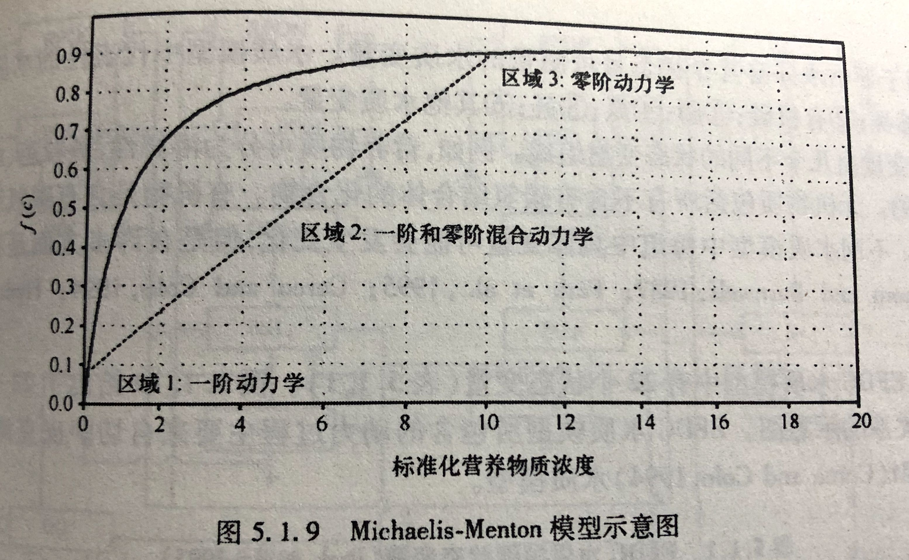

.footnote[

Figure via: Zhenggang Ji (2008)

]

---

## 模型中的运动项

+ .boldred[被动运动]通过涡（wo）流扩散建模，扩散系数为 $D_b$ ，并简化假设扩散系数垂向均一（作者取值 $D_R=D_b=10^1~m^2~d^{-1}$ 为弱混合状态， $10^3$ 可认为是强混合）；

--

+ .boldred[主动运动]则由趋性项（taxis term）建模：从生物学上说，如果藻类上部的状态更好，则向上移动，反之向下。为模拟该运动，作者令藻类的浮游速度 $v$ 是与生长速率的梯度（即 $\partial{g}/\partial{z}$ ）有关的变量，藻类向上移动则为 $v$ 的正方向。我们假设 $v$ 是奇减函数， $\partial{g}/\partial{z}$ 趋于负无穷则 $v=v_{max}$ ，反之 $\partial{g}/\partial{z}$ 趋于正无穷时则 $v=-v_{max}$ ，且 $v(0)=0$ 。作者将 $v(\partial{g}/\partial{z})$ 处理成以0为届的分段函数（.boldred[猜一猜，在模拟时这样处理会存在什么问题？]）

--

```{r simulate v function, echo=FALSE, message=FALSE, warning=FALSE, fig.width=3.8, fig.height=2.5, dev='svg', fig.align='center'}
x = -50: 50
y = -atan(x)
y = scales::rescale(y, c(-100, 100))
y_ = y
y_[x<0] = 100
y_[x>0] = -100
y_[x==0] = 0
library(ggplot2)
p_vmax <- ggplot() + 
  geom_line(aes(x=x, y=y)) + 
  # geom_line(aes(x=x[x<0], y=y_[x<0]), color="red", linetype=2) + 
  # geom_line(aes(x=x[x>0], y=y_[x>0]), color="red", linetype=2) + 
  geom_line(aes(x=x, y=y_), color="red", linetype=2) + 
  geom_text(aes(x=0, y=100, label="Approx."), hjust=0, vjust=1, nudge_x = 3,
            fontface="italic", color="red") + 
  geom_point(aes(x=0, y=0), color="red") + 
  labs(
    x = expression(italic(partialdiff~g / partialdiff~z)),
    y = expression(italic(v)),
    title = expression(italic(v)~"function"~"sample")
  ) + 
  theme_bw() + 
  theme(plot.title=element_text(hjust=0.5, face = "bold"))
p_vmax
```

---

## 模型中的生物量平衡

综上，.boldred[生物量]的平衡方程为： 

\begin{align}
\frac{\partial{b}}{\partial{t}} & =
\min\{f_I(I), f_R(R)\}b -
mb+
D_b\frac{\partial^2b}{\partial z^2} +
\frac{\partial}{\partial z}\Big[\ v \Big( \frac{\partial g}{\partial z}\Big) \Big] \\
& = [\text{Growth}]-[\text{Loss}]+[\text{Passive movement}]+[\text{Active movement}] \tag{1a}
\end{align}

.boldred[边界条件（B.C.）] 假设藻类不离开也不进入水柱，则在 $z=0$ 和 $z=z_b$ 处满足： 

\begin{align}
& {\Big[ D_b \frac{\partial b}{\partial z} + v \Big( \frac{\partial g}{\partial z} \Big) b \Big]}\bigg |_{z=0}  = \\
& {\Big[ D_b \frac{\partial b}{\partial z} + v \Big( \frac{\partial g}{\partial z} \Big) b \Big]}\bigg |_{z=z_b}  =  0 \tag{1b}
\end{align}

这是典型的no-flux边界问题，在方程离散中可以假设第一层与最底层的物质浓度分别与第二层与倒数第二层相同。

---

## 模型中的营养盐平衡

.boldred[营养盐]的平衡方程为：


\begin{align}
\frac{\partial R}{\partial t} & = -\frac{b}{Y}\min\{f_I(I), f_R(R)\} + D_R \frac{\partial ^2 R}{\partial z^2} + \varepsilon m \frac{b}{Y} \\
& = [\text{Uptake}]+[\text{Mixing}]+[\text{Recycling}] \tag{1c}
\end{align}

其中，营养盐 $R$ 被藻类吸收，每单位养分消耗的生物量为 $Y$ 生物量；与涡流扩散系数 $D_R$ 混合；营养盐不跃出水面但仅由底部供给，固定浓度为 $R_{in}$  ，水柱底部的营养盐浓度令为 $R(z_b)$ 。营养盐以与沉积物-水界面上的浓度差成比例的速率在整个沉积物-水界面上扩散，.boldred[B.C.]为：

\begin{align}
\frac{\partial R}{\partial z} \bigg |_{z=0} = 0, \frac{\partial R}{\partial z}\bigg |_{z=z_b} = h(R_{in}-R(z_b)) \tag{1d}
\end{align}

.boldred[注意]：参数 $h$ 表示界面渗透率（沉积物至水柱），当 $h \rightarrow 0$  则为no-flux边界，若 $h \rightarrow \infty$ 则为狄拉克雷边界（即固定值边界条件），此时 $R(z_b)=R_{in}$ ；

假设以 $\varepsilon$ 为比例地从死亡浮游植物中循环利用。

---

## 模型中的光能衰减

.boldred[光照]（光能）遵循朗伯比尔定律，受生物量和背景浊度引起的消光作用而减少：

$$I(z)=I_{\text{in}}\text{exp}\bigg(-\int_0^z[ab(z)+a_{bg}]dz\bigg)\tag{1e}$$

其中， $I_{\text{in}}$ 表示水表面的入射光能， $a$  表示藻类的比消光系数（比吸收加前向比散射）， $a_{bg}$  表示背景浊度的消光系数（以非藻类颗粒物为主）。

--

.center[
.size-35[

]
]

--

.center[.boldred[这么多公式，你怕不怕？]]

---
class: inverse, center, middle

# 容我打个岔

--

.size-30[

]

---

### 基于显示有限差分（FDM）求取数值解

[有限差分法](https://zh.wikipedia.org/wiki/%E6%9C%89%E9%99%90%E5%B7%AE%E5%88%86%E6%B3%95)是一种微分方程数值方法，通过有限差分来近似导数，从而寻求微分方程的近似解。我们再梳理一遍文章中重要的控制方程。

--

\begin{align}
\frac{\partial{b}}{\partial{t}} =
\min\{f_I(I), f_R(R)\}b -
mb+
D_b\frac{\partial^2b}{\partial z^2} +
\frac{\partial}{\partial z}\Big[\ v \Big( \frac{\partial g}{\partial z}\Big) \Big] \tag{1a}
\end{align}

\begin{align}
\text{with B.C. } {\Big[ D_b \frac{\partial b}{\partial z} + v \Big( \frac{\partial g}{\partial z} \Big) b \Big]}\bigg |_{z=0}  = {\Big[ D_b \frac{\partial b}{\partial z} + v \Big( \frac{\partial g}{\partial z} \Big) b \Big]}\bigg |_{z=z_b}  =  0 \tag{1b}
\end{align}

--

\begin{align}
\frac{\partial R}{\partial t} = -\frac{b}{Y}\min\{f_I(I), f_R(R)\} + D_R \frac{\partial ^2 R}{\partial z^2} + \varepsilon m \frac{b}{Y}  \tag{1c}
\end{align}

\begin{align}
\text{with B.C. } \frac{\partial R}{\partial z} \bigg |_{z=0} = 0, \frac{\partial R}{\partial z}\bigg |_{z=z_b} = h(R_{in}-R(z_b)) \tag{1d}
\end{align}

--

\begin{align}
I(z)=I_{\text{in}}\text{exp}\bigg(-\int_0^z[ab(z)+a_{bg}]dz\bigg) \tag{1e}
\end{align}

--

这怎么解？这是人算的吗？

--

不是。利用差分的原理，可以让计算机对这一类型的PDE求取数值解。

???
Chris的来信中说当时的研究使用的是欧拉法来离散时间的，建议采用Huismanhe和Sommeijer（2002）中“线的方法（[method of lines](https://www.sciencedirect.com/science/article/pii/S1385110102001375)）”。

---

class: center, middle


不怕才怪哦

---

## 举个例子

我们以最简单的一维扩散方程为例 $\frac{\partial c}{\partial t} = D \frac{\partial^2 c}{\partial x^2}$ ，其中 $c(x,t)$ 表示某种物质在 $t$ 时刻、 $x$ 位置上的浓度大小，假设其值域为 $0 \le x \le L$，求 $c(x,t)$ 在任意时刻的分布。

对于 $\frac{\partial c}{\partial t}$ 和 $\frac{\partial^2 c}{\partial x^2}$  则分别满足以下差分形式：

\begin{align}
\frac{\partial c(x,t)}{\partial t} & = \lim_{\Delta t \to 0} \frac{c(x,t) - c(x,t + \Delta t)}{\Delta t} \\
\frac{\partial^2 c(x,t)}{\partial x^2} & = \lim_{\Delta x \to 0} \frac{
\frac{\partial c(x+\Delta x, t)}{\partial x} - \frac{\partial c(x, t)}{\partial x}
}{\Delta x} \\
& = \lim_{\Delta x^2 \to 0} \frac{ c(x+\Delta x,t) - 2 c(x,t) + c(x-\Delta x,t) }{\Delta x^2}
\end{align}

--

在数值分析中，可以将上述公式中的 $\Delta x$ 和 $\Delta t$  确定为一个具体的.boldred[特别小的值]，即可以对扩散方程进行数值求解。

---

对 $\frac{\partial c}{\partial t} = D \frac{\partial^2 c}{\partial x^2}$ 中的 $x$ 和 $t$ 做时空上的离散化，生成一张分别以 $dx$ 和 $dt$ 为间隔的网格。 

.boldred[
$c(x,t)$ 为网格值 $c(x_i,t_j)$ 简写为 $c_i^j$ 表明在 $i$ 空间上， $t$ 时刻的物质浓度 。
]

```{r draw grid plot, echo=FALSE, fig.width=2.5, fig.height=2.5, dev='svg', fig.align='center', warning=FALSE, message=FALSE}
library(ggplot2)
numx = 6
numt = 6
x_ran = 1:numx
t_ran = 1:numt
xt_ran <- expand.grid(x_ran, t_ran)
grid_fdm <- ggplot(xt_ran) + 
  geom_point(aes(Var1 ,Var2)) + 
  geom_vline(aes(xintercept=Var1)) + 
  geom_hline(aes(yintercept=Var2)) + 
  labs(x="x", y="t") + 
  scale_x_continuous(breaks=x_ran, limit=c(min(x_ran),max(x_ran) + 1), 
                     expand=expansion(mult=c(0, 0.01), add=c(0.01, 0))) + 
  scale_y_continuous(breaks=t_ran, limit=c(min(t_ran),max(t_ran) + 1), 
                     expand=expansion(mult=c(0, 0.01), add=c(0.01, 0))) + 
  coord_fixed() + 
  theme_bw() + 
  theme(panel.grid.minor=element_blank(),
        text = element_text(size=15))
grid_fdm + 
  geom_point(inherit.aes = FALSE, aes(x=4, y=3), color = "red", size=2) + 
  geom_text(aes(4.5, 3.5), label=expression(italic(c[i]^{j})) , parse = TRUE)
```

--

因此，上一页的公式可以改写为：

\begin{align}
\frac{\partial c}{\partial t} = \frac{c_i^{j+1} - c_i^j}{dt}
\end{align}

\begin{align}
\frac{\partial^2 c}{\partial x^2} = \frac{ c^j_{i+1} - 2 c_i^j + c_{i-1}^j }{dx^2}
\end{align}

---

将上式代入 $\frac{\partial c}{\partial t} = D \frac{\partial^2 c}{\partial x^2}$ 得：

\begin{align}
\frac{c_i^{j+1} - c_i^j}{dt} = D \frac{ c^j_{i+1} - 2 c_i^j + c_{i-1}^j }{dx^2}
\end{align}

令 $\lambda = dt \times D / (dx^2)$ 则有：

\begin{align}
\lambda c^j_{i+1} + (1 -  2 \lambda) c_i^j + \lambda c_{i-1}^j = c_i^{j+1} \tag{*}
\end{align}

```{r warning=FALSE, message=FALSE, echo=FALSE, fig.width=2.5, fig.height=2.5, dev='svg', fig.align='center'}
grid_fdm + 
  geom_point(inherit.aes = FALSE, aes(x=4, y=4), color = "blue", size=2) + 
  geom_text(aes(4.5, 4.5), label=expression(italic(c[i]^{j+1})) , parse = TRUE) + 
  geom_point(inherit.aes = FALSE, aes(x=3, y=3), color = "red", size=2) + 
  geom_text(aes(3.5, 3.5), label=expression(italic(c[i-1]^{j})) , parse = TRUE) + 
  geom_point(inherit.aes = FALSE, aes(x=4, y=3), color = "red", size=2) + 
  geom_text(aes(4.5, 3.5), label=expression(italic(c[i]^{j})) , parse = TRUE) + 
  geom_point(inherit.aes = FALSE, aes(x=5, y=3), color = "red", size=2) + 
  geom_text(aes(5.5, 3.5), label=expression(italic(c[i+1]^{j})) , parse = TRUE)
```

因此，根据公式(*)，以及边界条件，即可逐步向前计算出 $c$ 的数值解。这种方法称之为.boldred[显式有限差分法]，也就是Chris在他研究中使用的那种。其逻辑简单明了，也易于编写程序。

---

## 代码实现 `r icon::fa("r-project", pull = "right")`

这里我们假设边界条件为no-flux条件，即 $\frac{\partial c}{\partial x} | _{x=0} = \frac{\partial c}{\partial x} | _{x=1} = 0$ 。

```{r eval=TRUE, cache=TRUE}
# 参数初始化
numx = 101; tstop = 0.1; D = 1
dx = 1/(numx-1)
dt = 0.00001
{{lam = dt * D / (dx ^ 2)}}
numt = floor(tstop / dt)
x = seq(0, 1, dx)
c = matrix(0, ncol=numt+1, nrow=numx)
t = rep(NA, numt+1)

# 用高斯函数模拟初始值
t[1] = 0; mu = 0.8; sigma = 0.1
for(i in 1:numx) {
  c[i,1] = 100+exp(-(x[i]-mu)^2/(2*sigma^2)) / sqrt(2*pi*sigma^2)
}
```

---

$\lambda c^j_{i+1} + (1 -  2 \lambda) c_i^j + \lambda c_{i-1}^j = c_i^{j+1}$ ，由 $j$ 向 $j+1$ 逐步推进，最终确定两个边界条件

```{r eval=TRUE, cache=TRUE}
for(j in 1:numt) {
  t[j+1] = t[j] + dt
  for(i in 2:(numx-1)) {
   {{c[i,j+1] = c[i,j] + (dt/dx^2) * (c[i+1,j]-2*c[i,j]+c[i-1,j])}}
  }
  c[1,j+1] = c[2,j+1]
  c[numx,j+1] = c[numx-1,j+1]
}
```

```{r echo = FALSE}
c_good <- c
t_good <- t
lam_good <- lam
```

--

.pull-left[

```{r warning=FALSE, message=FALSE, echo=FALSE, fig.width=3.5, fig.height=2.5, dev='svg', fig.align='center'}
# w <- seq(1, numt, floor(numt/5))
library(magrittr)
w <- apply(data.frame(0, 0.02, 0.05, 0.1), 2, function(x) {
  which.min(abs(x-t))
}) %>% t %>% as.vector
library(magrittr)
c_good[, w] %>%
  data.frame() %>%
  setNames(., round(t[w],3 )) %>% 
  cbind(x, .) %>%
  reshape2::melt(., id="x") %>%
  ggplot(data=.) + 
  geom_path(aes(x=x, y=value, group=variable, color=variable)) + 
  labs(x="x", y="c", color="t", title = sprintf("lam=%s", lam_good)) + 
  theme_bw() + 
  theme(plot.title = element_text(hjust=0.5))
```
随着时间变化，物质因水平扩散逐渐平稳。

]

--

.pull-right[

```{r cache=TRUE, warning=FALSE, message=FALSE, echo=FALSE, fig.width=3.5, fig.height=2.5, dev='svg', fig.align='center'}
dt = 0.00008
lam = dt * D / (dx ^ 2)
numt = floor(tstop / dt)
x = seq(0, 1, dx)
c = matrix(0, ncol=numt+1, nrow=numx)
t = rep(NA, numt+1)

# 用高斯函数模拟初始值
t[1] = 0
mu = 0.8
sigma = 0.1
for(i in 1:numx) {
  c[i,1] = 100+exp(-(x[i]-mu)^2/(2*sigma^2)) / sqrt(2*pi*sigma^2)
}

for(j in 1:numt) {
  t[j+1] = t[j] + dt
  for(i in 2:(numx-1)) {
    {{ c[i,j+1] = c[i,j] + (dt/dx^2) * (c[i+1,j]-2*c[i,j]+c[i-1,j]) }}
  }
  c[1,j+1] = c[2,j+1]
  c[numx,j+1] = c[numx-1,j+1]
}
c_bad = c
t_bad = t
lam_bad = lam

w <- apply(data.frame(0, 0.02, 0.05, 0.1), 2, function(x) {
  which.min(abs(x-t_bad))
}) %>% t %>% as.vector
library(magrittr)
c_bad[, w] %>%
  data.frame() %>%
  setNames(., round(t[w],3 )) %>% 
  cbind(x, .) %>%
  reshape2::melt(., id="x") %>%
  ggplot(data=.) + 
  geom_path(aes(x=x, y=value, group=variable, color=variable)) + 
  labs(x="x", y="c", color="t", title = sprintf("lam=%s", lam_bad)) + 
  theme_bw() + 
  theme(plot.title = element_text(hjust=0.5))

# ggplot() +
#   geom_path(aes(x=t_good, y=c_good[51, ]), color="blue") +
#   geom_path(aes(x=t_bad, y=c_bad[51, ]), color="red") + 
#   xlim(0, 0.03) + 
#   ylim(90, 110) + 
#   coord_cartesian(clip = "off")
```

.boldred[缺点]：当 $\lambda = \frac{dt \times D}{dx^2} \le \frac{1}{2}$ 不满足时，则显式有限差分.boldred[不稳定]，原地爆炸。

]

---

class: middle

## Algal Game控制方程的求解过程

1. 控制方程离散化，保证 $\lambda \le \frac{1}{2}$ ；

2. 基于高斯函数确定初始藻生物量分布（ $b_i^1$ ），基于底部 $R_{in}$ 的营养盐浓度向表层线性衰减确定营养盐初始值分布（ $R_i^1$ ），基于比尔定律和初始藻类分布确定光能的垂向值（ $I_i^1$ ）；

3. 以显式差分形式逐步求解正向时间的 $b_i^j$ , $R_i^j$ , $I_i^j$ ，根据边界条件确定 $b_0^j$ , $b_{numz}^j$ , $R_0^j$ 和 $R_{numz}^j$ 。

4. 解译模拟结果，并调整初始参数。


---
class: middle, inverse, center

# 打岔完毕

# 回归正题

--


---

### 论文中（如未提及）默认使用的参数表如下

.center[

.size-60[

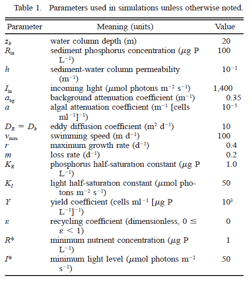

]]


---

## 再再看一遍控制方程

\begin{align}
\frac{\partial{b}}{\partial{t}} =
\min\{f_I(I), f_R(R)\}b -
mb+
D_b\frac{\partial^2b}{\partial z^2} +
\frac{\partial}{\partial z}\Big[\ v \Big( \frac{\partial g}{\partial z}\Big) \Big] \tag{1a}
\end{align}

\begin{align}
\text{with B.C. } {\Big[ D_b \frac{\partial b}{\partial z} + v \Big( \frac{\partial g}{\partial z} \Big) b \Big]}\bigg |_{z=0}  = {\Big[ D_b \frac{\partial b}{\partial z} + v \Big( \frac{\partial g}{\partial z} \Big) b \Big]}\bigg |_{z=z_b}  =  0 \tag{1b}
\end{align}

\begin{align}
\frac{\partial R}{\partial t} = -\frac{b}{Y}\min\{f_I(I), f_R(R)\} + D_R \frac{\partial ^2 R}{\partial z^2} + \varepsilon m \frac{b}{Y}  \tag{1c}
\end{align}

\begin{align}
\text{with B.C. } \frac{\partial R}{\partial z} \bigg |_{z=0} = 0, \frac{\partial R}{\partial z}\bigg |_{z=z_b} = h(R_{in}-R(z_b)) \tag{1d}
\end{align}

\begin{align}
I(z)=I_{\text{in}}\text{exp}\bigg(-\int_0^z[ab(z)+a_{bg}]dz\bigg) \tag{1e}
\end{align}

--

Chris认为，当假设上述变量不随 $\partial t$ 发生变化变化时，则认为生物量、营养盐和光照在水柱中达到了某种.boldred[平衡]的状态（.bold[Equilibrium vertical distribution]）。

--

.center[
.boldred[猜一猜，你觉得有可能平衡吗？]
]

---

#### 平衡状态下不同浮游速度的生物量，营养盐和光照的垂向分布（A、B、C）

如图A所示，当藻类不主动浮动时，它们基本上在垂向上呈均匀分布的状态（此时 $D=10^1~m^2d^{-1}$ ，处于弱混合状态）。

.center[

.size-90[

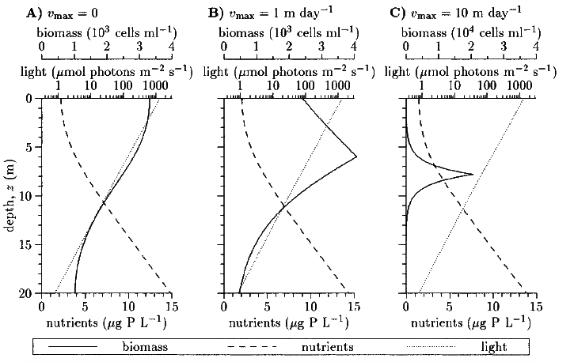

]]

---

#### 平衡状态下不同浮游速度的生物量，营养盐和光照的垂向分布（D、E、F）

随着浮游速度的增加（至 $10^3~m~day^{-1}$ ）时，藻类则逐渐.boldred[聚集到一个非常薄的层]，记为 $z_l$ 。

.center[

.size-90[

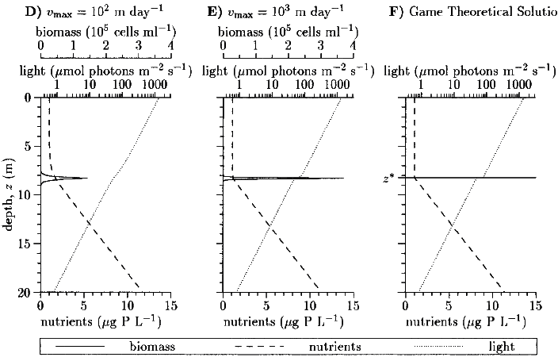

]]

---

### 藻类生存博弈论

对弱混合水柱中藻类薄层的现场观察和以上结果表明，我们可以用.boldred[无限薄层]近似地估算浮游植物的分布。（.boldred[相比DCM的宽峰，该薄层是否更容易理解的多了？]）

此时假设藻类在 $z_l$ 层形成了无限薄层，令 $b(z)=B \delta (z_l)$ ，其中 $\delta (z_l)$ 是狄拉克函数， $B$ 是.boldred[单位水柱中的柱总生物量]，因此 $b(z)$ 可以表示为：

\begin{align}
b(z) = 
\left\{
  \begin{array}
  +\infty , z = z_l \\
  0, z \ne z_l
  \end{array}
\right. \tag{2a}
\end{align}

$$
\int_0^{z_b}b(z)dz=B \tag{2b}
$$

在博弈论研究中，所有的藻类近乎超人一般飞速的上浮下沉，且无视碰撞体积。由于假设藻类的浮游速度已经远远超过湍（tuan）流的混合作用（即 $D_b/v_{max} \ll z_b$），此时我们设定 $D_b = 0$ 。

--

以无限薄层 $z_l$ 近似藻类的分布位置后简化了藻类对于生存限制因素的响应规律，据此Chris开展了对于藻类生存策略的论述：

.center[.boldred[

#### 藻类生存的博弈之《我的公式会说话》 --- Chris Klausmeier

]]

---

### 藻类生存博弈论

控制方程（1a-e）在略去时间项后，可以由 $z_l$ 与 营养盐限制差异对平衡态的生物量做化简（推导过程略），得出以下重要项目的公式结论（其中 $\hat{}$ 表示平衡态下物理量）。

--

平衡态下的营养盐浓度：

\begin{align}
\hat{R}(z) = \left\{
  \begin{array}{lr}
    \hat{R}(z_l), & 0 \le z \le z_l \\
    \hat{R}(z_l) + (z-z_l)\frac{R_{in}-\hat{R}(z_l)}{z_b+1/h-z_l}, & z_l < z \le z_b
  \end{array}
\right. \tag{A7}
\end{align}

> 这个公式在说： $\hat{R}$ 在 $z_l$ 上部为常数，而在其下部则随深度呈线性增加趋势

--

平衡态下的光照：

\begin{align}
\hat{I}(z) = \left\{
  \begin{array}{lr}
    I_{in}e^{-a_{bg}z}, & 0 \le z \le z_l \\
    I_{in}e^{-a\hat{B}-a_{bg}z}, & z_l < z \le z_b
  \end{array}
\right. \tag{A8}
\end{align}

> 光能在 $z_l$ 上部因背景消光呈指数型衰减，经过 $z_l$ 时因藻类消光作用跌落一定数量

---

营养盐限制下的柱总生物量：

$$\hat{B}=\frac{YD_R(R_{in}-R^*)}{m(1-\varepsilon)(z_b+1/h-z_l)} \tag{A13}$$

光限制下的柱总生物量

$$\hat{B} = \frac{\text{log}(I_{in}/I^*)}{a}-\frac{a_{bg}}{a}z_l  \tag{A15}$$
> $b$ 在薄层的平衡态取决于藻类是.boldred[受营养盐限制还是光照的限制]。

--

<br>

现在，我们知道了在 $z_l$ 处给定的光照和养分的平衡分布，有没有一个深度可以阻止水柱中其他地方的藻类生长呢（ $g(z) \le 0$ ）？

<br>

.center[
换句话说，有没有一个深度是.boldred[只有藻类能够生长而其他地方却逐渐消亡]的？
]

---

.center[

.size-80[

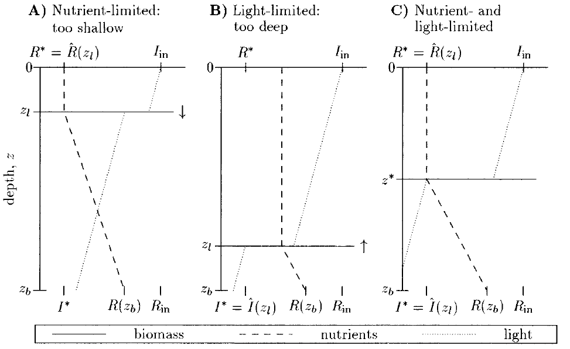

]]

回忆一下两种限制因素的空间特性：.boldred[光能从顶部向下逐渐衰减，而营养盐从底部向上逐渐衰减]。因此，对于限制条件的不同，Chris模拟了三种情况下平衡态结果：

--

（A）营养盐限制（对于浅型水体）：虽然在 $z_l$ 往上因 $R^*$ 的限制导致藻类无法生长，但 $z_l$ 向下营养逐渐增多，此时光照对于藻类也不受限，所以在 $z_l$ 以下的水体.boldred[藻类仍然能够生长]。


---

.center[

.size-80[


]]

（B）光照限制（对于柱体较深）：虽然在 $z_l$ 往下 $I^*$ 的限制导致藻类无法生长，但 $z_l$ 向上光照充足，且 $R(z \le zl) > R^*$ 不受营养限制，所以在 $z_l$ 以上的水体.boldred[藻类仍然能够生长]。

--

（C）只有在 $z_l$ 层中同时受到光照和营养盐的限制时，藻类才.boldred[只在]该层生长。

.center[

我们定义（C）情况中的 $z_l$ 层为藻类的.boldred[进化稳定策略层]

（evolutionary stable strategy layer）记为 $z^*$ 

]

---

联合公式（A13）与（A15）后可得计算 $z^*$ 深度的公式如下（描述了图C的状态）：

\begin{align}
[\text{light-limited biomass}] & = [\text{nutrient-limited biomass}] \\
\frac{\text{log}(I_{in}/I^* )}{a}-\frac{a_{bg}}{a}z^* & = \frac{YD_R(R_{in}-R^* )}{m(1-\varepsilon)(z_b+1/h-z^*)} \tag{4}
\end{align}

该公式说明：对于未处于ESS（进化稳定状态）的水体剖线， $z^*$的位置是整个藻类群落一个收敛的稳定态。如果 $0 < z^* < z_b$ ，那么藻类的生存对策会导致水柱中形成DCM（深层Chl峰值）。假设藻类不离开水面，若 $z^* < 0$ ，则表明该当前水柱在光限制作用下导致藻类向表层 $z=0$ 方向聚拢，最终形成表面水华；若 $z^* > z_b$ ，则表明当前水柱在营养盐限制作用下导致藻类向底层 $z=z_b$ 方向堆积，最终形成底栖（qi）层。

--

上述三种 $z^*$ 分布中，对应了柱总生物量的求解方法如下：

\begin{align}
\hat{B}=\left\{
  \begin{array}{lll}
    \frac{\text{log}(I_{in}/I^* )}{a}, & z^* \le 0 & (\text{surface layer}) \\
    \frac{\text{log}(I_{in}/I^* )}{a}-\frac{a_{bg}}{a}z^* = \frac{YD_R(R_{in}-R^* )}{m(1-\varepsilon)(z_b+1/h-z^* )}, & 0 < z^* < z_b & (\text{DCM}) \\
    \frac{YD_Rh}{m(1-\varepsilon)}(R_{in}-R^* ), & z^* \ge z_b & (\text{benthic layer})
  \end{array}
\right. \tag{5}
\end{align}

该公式说明，当 $z^*$ 在水表层，生物量的增加与对数变换后的入射光能有关（与沉积物营养盐无关）；而当 $z^*$ 在底层时，生物量的增加与底部沉积物营养盐的释放有关（与入射光能无关）。

---

## 进化稳定策略层 $z^*$ 的求解

\begin{align}
\frac{\text{log}(I_{in}/I^* )}{a}-\frac{a_{bg}}{a}z^* = \frac{YD_R(R_{in}-R^* )}{m(1-\varepsilon)(z_b+1/h-z^*)} \tag{4}
\end{align}

尽管公式（4）中可以解算 $z^*$ ，但是没有办法提供更多的信息（我认为Chris想说的是变量之间的相关性）。为了简化公式（4），作者给出了两个限制性假设：.boldred[（1）无背景消光]（ $a_{bg}=0$ ）；.boldred[（2）无藻类消光]（ $a=0$ ）。在考虑这两个简化的公式（4）后我们再回到完整的公式（4）。

--

.center[.large[.boldred[（1）只考虑藻类光学衰减]]]

此时 $a_{bg}=0$ （.bold[什么样水体？]），公式（4）可以简化为：

\begin{align}
z^*=z_b + \frac{1}{h} - \frac{aYD_R(R_{in}-R^*)}{m(1-\varepsilon)\text{log}(I_{in}/I^*)} \tag{6}
\end{align}

公式（6）告诉了我们什么？水柱中营养盐的补给主要来源于四个参数： $R_{in}$ （沉积物营养盐）， $h$ （渗透率）， $D_R$ （营养盐扩散系数）， $\varepsilon$ （藻类残体再回收系数）。升高它们任意一个都会导致 $z^*$ 的降低，最终导致其接近水表面。反之，增强的表面光照会提高 $z^*$ ，导致更深的藻类峰位置。

---

.center[.boldred[（1）只考虑藻类光学衰减（续）]]

\begin{align}
z^*=z_b + \frac{1}{h} - \frac{aYD_R(R_{in}-R^*)}{m(1-\varepsilon)\text{log}(I_{in}/I^*)} \tag{6}
\end{align}

其他研究发现，藻类种群中存在对营养盐限制水平更低的类型（低 $R^*$ ），他们可以生成更小的 $z^*$ ；同样也有种群对光能的耐受性更强（低 $I^*$ ），导致更深的 $z^*$ 。可以想象，如果 $z^* <0$ ，即藻类位于水面以上（同时受光照限制），此时公式（6）满足：

\begin{align}
R_{in} > R^* + \frac{m(1-\varepsilon)\text{log}(I_{in}/I^*)}{aYD_R}\big( z_b + \frac{1}{h} \big) \tag{7}
\end{align}

公式（7）告诉我们对于.boldred[浅而富营养化的湖泊]（低 $z_b$ 且高 $R_{in}$ ）足以造成表层堆积型藻华。

--

如果 $z^* > z_b$ ，即藻类位于底层（受营养盐限制），此时公式（6）满足：

\begin{align}
R_{in} < R^* + \frac{m(1-\varepsilon)\text{log}(I_{in}/I^*)}{haYD_R} \tag{8}
\end{align}

--

此时，平衡态的藻类等于：

\begin{align}
\hat{B}=\left\{
  \begin{array}{lll}
    \frac{\text{log}(I_{in}/I^* )}{a}, & z^* < z_b & (\text{surface layer, DCM}) \\
    \frac{YD_Rh}{m(1-\varepsilon)}(R_{in}-R^* ), & z^* \ge z_b & (\text{benthic layer})
  \end{array}
\right. \tag{9}
\end{align}

---

.center[.large[.boldred[（1）只考虑藻类光学衰减（续）]]]

.center[
.size-70[
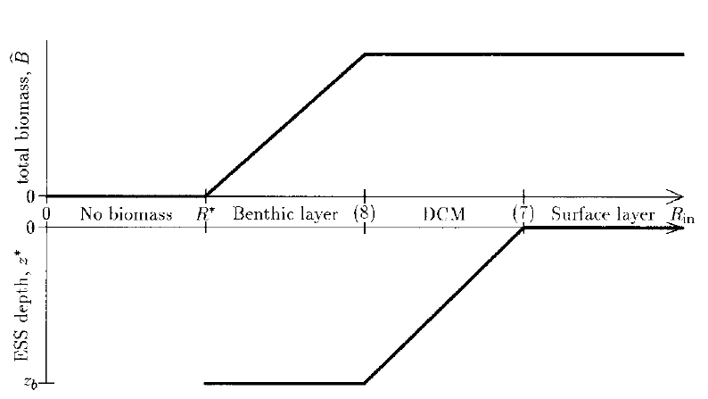
]]

\begin{align}
R_{in} & > R^* + \frac{m(1-\varepsilon)\text{log}(I_{in}/I^*)}{aYD_R}\big( z_b + \frac{1}{h} \big) \tag{7} \\
R_{in} & < R^* + \frac{m(1-\varepsilon)\text{log}(I_{in}/I^*)}{haYD_R} \tag{8}
\end{align}

该图说明了营养盐富集对平衡态生物量和 $z^*$ 的影响：在清澈的水体中（忽略背景消光），养分富集并不会影响平衡态DCM的生物量，而只会降低 $z^*$ 。

---

.center[.large[.boldred[（2）只考背景光学衰减]]]

此时藻类颗粒并不影响光照的衰减，即 $a=0$ ，平衡态的藻类深度约等于只受背景光学衰减的最大生长深度：

\begin{align}
z^* = z_{max} = \frac{\text{log}(I_{in}/I^*)}{a_{bg}} \tag{10}
\end{align}

--

公式（10）中，因为 $z^* > 0$ ，所以表面堆积型藻分布需要满足 $a \ne 0$ ，与当前假设相矛盾，故不存在此种分布形态。然而，底栖（qi）层藻类峰仍然存在（当 $z^*>z_b$ ），等效于：

\begin{align}
a_{bg} < \frac{\text{log}(I_{in}/I^*)}{z_b} \tag{11}
\end{align}

--

藻类柱总生物量等于：

\begin{align}
\hat{B} = \left\{
  \begin{array}{lll}
    \frac{YD_R(R_{in}-R^* )}{m(1-\varepsilon)\big(z_b + \frac{1}{h} - \frac{\text{log}(I_{in}/I^* )}{a_{bg}}\big)}, & 0 < z^* < z_b & (\text{DCM}) \\
    \frac{YD_Rh}{m(1-\varepsilon)(R_{in}-R^* )}, & z^* \ge z_b & (\text{benthic layer})
  \end{array}
\right. \tag{12}
\end{align}

---

.center[.large[.boldred[（2）只考背景光学衰减（续）]]]

.center[
.size-70[
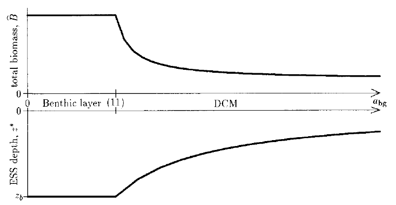
]]

\begin{align}
a_{bg} < \frac{\text{log}(I_{in}/I^*)}{z_b} \tag{11}
\end{align}

该图说明了背景衰减对平衡态藻生物量和 $z^*$ 的影响：增加背景衰减可以防止底栖（qi）层的出现，同时减少柱总生物量浓度。

---

.center[.large[.boldred[（3）藻颗粒和背景光学衰减都考虑时]]]

都考虑时，公式（4）和（5）变得很复杂，Chris使用差分法讨论其他因素对 $z^*$  ， $\hat{B}_\text{surface layer}$ ， $\hat{B}_\text{DCM}$ ， $\hat{B}_\text{benthic layer}$ 的影响。


```{r echo=FALSE, warning=FALSE, message=FALSE}
library(magrittr)
library(kableExtra)
library(dplyr)
ef <- matrix("Increases", ncol=5, nrow=12) %>% 
  data.frame(., stringsAsFactors = FALSE) %>%
  setNames(., c("\\(\\text{Increase}\\)", "\\(z^*\\)", "\\(\\hat{B}_\\text{surface layer}\\)", 
                "\\(\\hat{B}_\\text{DCM}\\)", "\\(\\hat{B}_\\text{benthic layer}\\)"))

ef[, 1] <- c("\\(I_{\\text{in}}\\)表面光照", "\\(I^*\\)最低光照", "\\(a\\)藻比消光", "\\(Y\\)吸收率", 
             "\\(D_R\\)扩散系数", "\\(R_{\\text{in}}\\)沉积物磷", "\\(R^*\\)最低磷", "\\(z_b\\)水柱总深",
             "\\(h\\)底部渗透率", "\\(a_{bg}\\)背景消光", "\\(\\varepsilon\\)回收率", "\\(m\\)损失率")

ef[c(2:6,9:11), 2] <- "Decreases"
ef[12, 2] <- "In. for small m<br>De. for large m"

ef[c(2:3, 12), 3] <- "Decreases"
ef[c(4:11), 3] <- "---"

ef[c(2:3, 7:8, 10, 12), 4] <- "Decreases"

ef[c(7, 12), 5] <- "Decreases"
ef[c(1:3, 8, 10), 5] <- "---"

background_fun <- function(x) {
  result <- ifelse(x=="Increases", "lightgreen", "lightcoral")
  result[x!="Increases" & x!="Decreases"] <- "lightgreen"
  result[x==ef[12,2]] <- "lightblue"
  result[x=="---"] <- "NULL"
  return(result)
}

color_fun <- function(x) {
  result <- ifelse(x=="---", "black", "white")
  return(result)
}

ef %>%
  # cell_spec(which(ef == "Decreases"), "html", color="white", background = "red") %>%
  # mutate(
  #   Increase = cell_spec(Increase, "html", color="white", background = "green"), 
  # ) %>%
  mutate_if(is.character, function(x) {
    cell_spec(x, "html", color="black", escape = FALSE,
              background = background_fun(x), bold=TRUE, font_size="small")
  }) %>%
  # mutate_if(is.character, function(x) {
  #   cell_spec(x, "html", color="white", 
  #             background = ifelse(x==ef[12,2], "yellow", ""))
  # }) %>%
  # cell_spec(which(ef == ef[12,2]), color="white", background = "yellow") %>%
  kable(format = "html", escape=FALSE, align = "c") %>%
  kable_styling(bootstrap_options = c("hover"), full_width = FALSE, font_size=13) %>%
  column_spec(1:5, width="2in")
```

---

.center[.large[.boldred[（3）藻颗粒和背景光学衰减都考虑时（续）]]]

总的来说：

1. 光照等级的增加（无论是增加 $I_{in}$ 还是降低漫衰减系数 $a$ 和 $a_{bg}$ ）或 增加光照利用的竞争能力（即降低 $I^*$ ）会导致更深的 $z^*$ ；

2. 增加营养盐补给（无论是增加 $R_{in}$ ， $D_R$ ， $h$ 还是 $\varepsilon$ ）或提高营养利用的竞争能力（即降低 $R^*$ ）会导致 $z^*$ 向表层方向移动。

3. 水柱深度（ $z_b$ ）的增加会导致更深的 $z^*$ ，接近由背景衰减确定的最大可能深度 $z_{max}$ ；

4. DCM的柱总生物量随竞争能力（ $R^*$ 和 $I^*$ ）和两种资源的供应能力的增加而增加，且随水柱深度增加而减少。

.small[

\begin{align}
\frac{\text{log}(I_{in}/I^* )}{a}-\frac{a_{bg}}{a}z^* = \frac{YD_R(R_{in}-R^* )}{m(1-\varepsilon)(z_b+1/h-z^*)} \tag{4}
\end{align}

\begin{align}
\hat{B}=\left\{
  \begin{array}{lll}
    \frac{\text{log}(I_{in}/I^* )}{a}, & z^* \le 0 & (\text{surface layer}) \\
    \frac{\text{log}(I_{in}/I^* )}{a}-\frac{a_{bg}}{a}z^* = \frac{YD_R(R_{in}-R^* )}{m(1-\varepsilon)(z_b+1/h-z^* )}, & 0 < z^* < z_b & (\text{DCM}) \\
    \frac{YD_Rh}{m(1-\varepsilon)}(R_{in}-R^* ), & z^* \ge z_b & (\text{benthic layer})
  \end{array}
\right. \tag{5}
\end{align}

]

---

对于藻类消亡率（ $m$ ）而言， $z^*$ 的计算更为复杂（因为 $m$ 的变化直接导致 $R^*$ 和 $I^*$ 的变化，这两者对 $z^*$ 是相反的作用）。

尽管 $m$ 对生物量和 $z^*$ 的影响并未得到公式证明（它不像 $a$ 或 $a_{bg}$ 项那样可以做简化），但Chris的数值模拟结果表明， $z^*$ 首先随低值的 $m$ 增加而增加，即藻类消亡速率增加后降低了生物量，使得更多的光进入更深的水体，使得藻类可生长的深度逐渐降低；随后，则逐渐随高值 $m$ 的增加而衰减，此时更高的 $m$ 意味着藻类需要更多的光照得以生存。柱总生物量 $\hat{B}$ 随 $m$ 增加而逐渐降低。

.center[
.size-65[
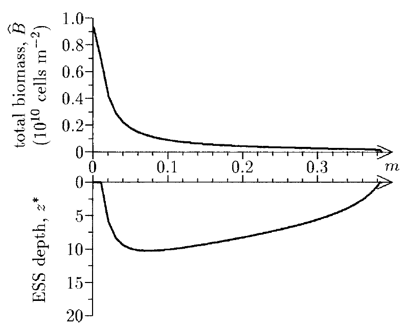
]]

---

.center[
.size-70[
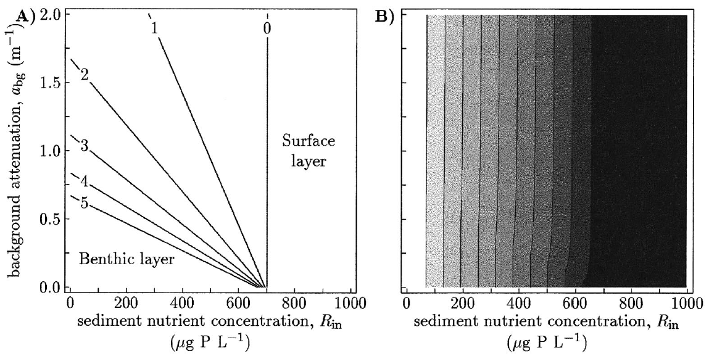
]]

.small[

\begin{align}
\frac{\text{log}(I_{in}/I^* )}{a}-\frac{a_{bg}}{a}z^* = \frac{YD_R(R_{in}-R^* )}{m(1-\varepsilon)(z_b+1/h-z^*)} \tag{4}
\end{align}

图A中为解公式（4） $R_{in}$ 与 $a_{bg}$ 在不同 $z^*$ 的响应关系。

\begin{align}
\hat{B}=\left\{
  \begin{array}{lll}
    \frac{\text{log}(I_{in}/I^* )}{a}, & z^* \le 0 & (\text{surface layer}) \\
    \frac{\text{log}(I_{in}/I^* )}{a}-\frac{a_{bg}}{a}z^* = \frac{YD_R(R_{in}-R^* )}{m(1-\varepsilon)(z_b+1/h-z^* )}, & 0 < z^* < z_b & (\text{DCM}) \\
    \frac{YD_Rh}{m(1-\varepsilon)}(R_{in}-R^* ), & z^* \ge z_b & (\text{benthic layer})
  \end{array}
\right. \tag{5}
\end{align}

图B中为公式（5）中对应的平衡态柱总生物量。

除 $a_{bg} = 0$ 时，生物量随 $R_{in}$ 而增加直到 $z^*$ 到达水表层。注意， $z^*$ 到达水表层时， $R_{in}$ 与 $a_{bg}$ 无关。

]

---

.center[
.size-60[
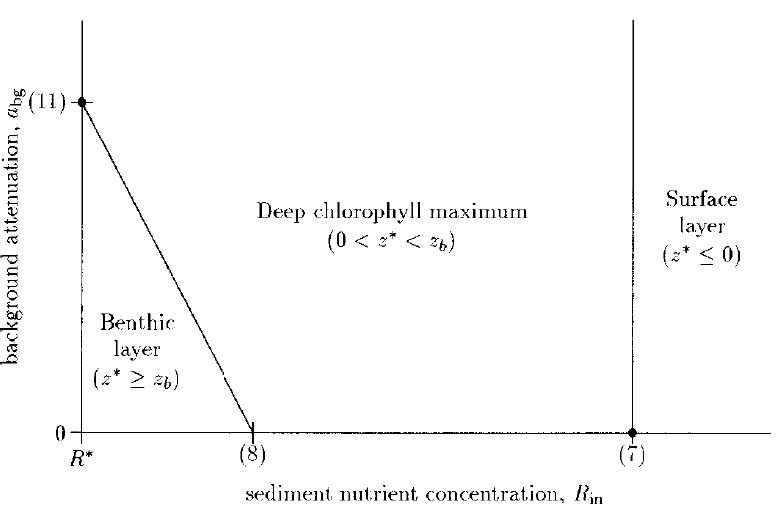
]]

.smallest[

\begin{align}
R_{in} & > R^* + \frac{m(1-\varepsilon)\text{log}(I_{in}/I^*)}{aYD_R}\big( z_b + \frac{1}{h} \big) \tag{7} \\
R_{in} & < R^* + \frac{m(1-\varepsilon)\text{log}(I_{in}/I^*)}{haYD_R} \tag{8} \\
a_{bg} & < \frac{\text{log}(I_{in}/I^*)}{z_b} \tag{11}
\end{align}

]

.small[

该图简述了 $R_{in}$ 和 $a_{bg}$ 对水柱垂向分布的影响（其中7、8、11点对应各自公式）：当营养水平很高时，总会形成Surface layer（此时为光限制）；当营养水平很低时（刚满足藻类生长需要），低浊度的水体会形成Benthic layer；除此外，水柱中会形成DCM。

DCM最有可能在深水柱中，因为增加 $z_b$ 会使点（7）向右移动，而点（11）向下移动，从而增加了导致DCM的参数空间的大小。

]

---

## 讨论 --- 1. 模型预测

Chris的Algal Game模型成功地复制了弱混合条件下藻类主要的分布模式，例如Surface layer，DCM和Benthic layer三种。该模型也产生了许多重要的关系（那张红绿的表），一部分关系已经被自然水体充分证明，而也有一些关系为确定藻类分布的因素提供了新的见解。

--

.boldred[第一个预测]是，具有调节深度功能的浮游植物会在弱混合的水柱中形成薄层，这一结果已经有广泛的经验观测作为支持（略），同时这也激发了Chris从博弈论角度去考虑藻类垂向分布的状态。Algal Game模型结果表明，湍流程度（D）决定了DCM的厚度。Fee （1976）在面积较小且混合较弱的湖泊中（D约为 $10^{-3}$ 或 $10^{-2}~m^2 d^{-1}$ ）观察到了极为薄的水层（几到十几厘米）；而在扩散系数更高的水体中（如 Abbott等1984在Lake Tahoe观测的 $10^1~m^2 d^{-1}$ ），DCM厚度可达10-20 m。

--

.boldred[第二个预测]是，限制藻类生长的营养盐物质浓度在藻类层上方恒定，并随着该层下方的深度呈线性增加。该预测结果与之前已有研究的结论一致（略），其正如Cullen（1982）指出的那样，“DCM实际上可以确定营养盐跃层的位置。”

---

.boldred[第三个预测]是，DCM或Surface layer以下的光照水平是收支平衡的光照水平（即 $I^*$ ）。这是因为ESS深度（即 $z^*$ ）是藻类受光照与营养盐共同限制的结果，在该深度除水柱的背景光衰减外，还存在藻类聚集后自身对光照遮蔽的作用。

--

.boldred[第四个预测]是，通过求解公式（4）和（5）计算了平衡态下的藻类峰值深度与柱总生物量。最普遍的结果为下图所示。

.pull-left[

在浅水区（小 $z_b$ ），贫营养区（小 $R_{in}$ ）和清澈水（小 $a_{bg}$ ）主要存在为底栖层；

在深水（大 $z_b$）中主要为DCM层；

在浅水，富营养化（大 $R_{in}$ ）水域中出现藻华堆积型剖线。

]

.pull-right[

.center[


]

]

--

.boldred[第五个预测]涉及不同深度藻类的资源限制。模型分析表明，表层堆积型垂向分布受光限制，底栖层分布受营养盐限制，DCM分布受两种资源共同限制。.boldred[表层堆积型的剖线不可能存在营养盐限制，否则的话，藻类会移动到更深处的水层（那里拥有更多的营养盐）]。而当底栖层发生时，Algal Game模型暗示藻类控制着营养盐物质从沉积物中到水柱中的流量。

---

## 讨论 --- 2. 与其他模型的对比

.boldred[竞争关系模拟的全新版本]：Huisman和Weissing（1994和1995）的模型考虑了高度混合水柱中藻类关于营养盐和光能的竞争关系，其中生物量和营养盐假设为在水柱中均匀分布，而光能则随深度呈指数衰减。对于光竞争能力的表达，他们的模型中以到达水柱底部的光（ $I_{out}$ ）衡量藻类对光能的竞争能力。而Chris的模型是利用表面入射辐照度（ $I_{in}$ ）和 $I^*$ 来衡量的。

--

.boldred[限制因素的全新版本]：Huisman的模型将光照作为唯一的限制性因素，并认为如果藻类没有沉降作用时，肯定随深度而逐渐降低；而只有当藻类存在沉降时才会存在DCM。Britton和Timm（1993）的模型也得出了相似的结论。相反，Chris的模型不需要考虑考虑沉降的作用，同样也能在光照限制条件下预测出DCM以及表层堆积的剖线分布。

--

Chris的模型中没有考虑扩散系数D的深度变异性（即目前它是一个常数），但是只要在 $z^*$ 处满足弱混合的基本假设，则Algal Game模型的预测是准确的。这同时也说明了一个事实，即.boldred[低风速和因此导致的弱混合作用是生成表层堆积藻类剖线的先决条件]。

---

### 讨论 --- 3. Algal Game模型未涉及的因素


- 氧气状态通常随深度变化，对生物区系和营养动态产生重大影响；

- 还不包括光抑制，可变的配额和对养分的奢侈摄取以及与深度相关的草食动物；

- 此外，养分只能通过混合沉淀物或立即回收来提供；实际上，整个水柱中都可以提供营养盐；

- 浮游生物质的湍流混合也会影响浮游植物的分布；

对该模型的扩展以包括所有这些过程将进一步发展我们对浮游植物群落垂直结构的理解。


---

### 为什么我推荐这篇文章？

最初的原因在于它有一个非常有趣的名字`Algal Game`，而实际上它将营养盐和光照作为藻类生长双重限制因素的建模过程更为有趣，尤其是对于藻类运动过程的区分描述。

--

.boldred[简单来说，我就是馋他的模型。]

--

Chris说：

> .boldred[The program is available] from the first author.

--

这真是天大的好事。

--

然后我就很激动地写邮件问他要了，结果发过来的一份**超过20岁的、没有一行注释的、所有变量全靠猜（他承认大部分变量他也不记得了）、存在好几个无法修复的`typo`错误的**Fortran代码。最终我放弃了，我只好按照他提供的参数表和控制方程用`R`重新写了一遍（这期间又得重新恶补差分的数学知识）。

--

接着我发现他的数值模拟中所用的`显式差分法`.boldred[存在稳定性很差的问题]，而他给我的每一封回信中都让我用Huisman的`method of line`（另一种PDE解法），同时劝我放弃使用他陈旧的代码。直到我调参了很多次都无法保证`Algal Game`在初期阶段保持稳定时，我终于忍不住去看他推荐的Huisman的论文。

---

### 为什么我推荐这篇文章？

结果，Huisman（2002）在建模部分“痛骂”显式差分用于藻类剖线模拟时的弊端：

--

> We warn that such numerical artefacts can easily occur if the time integration of .boldred[[a  stiff ODE](https://www.youtube.com/watch?v=GuyUuJETkZk)] is not carefully performed.

--

> However, explicit methods have a .boldred[serious disadvantage] for stiff ODE systems, because they are forced to take very small time steps in order to avoid numerical instabilities.

--

Chris所构建的控制方程是典型的刚性（stiff）方程，即时间步长和空间步长存在不协同的现象（譬如，长时间不发生变化的系统但取了很短的时间间隔）；


--

.pull-left[

同时，对于藻类主动运动的速率由分段函数确定，这直接导致了在高 $v_{max}$ 设置下前期模拟出现很强的扰动性。这也可能是他重点在于分析.boldred[平衡状态]的原因，如果按这个思路，这样确定藻类游动速率也不成问题。我如果直接用平衡态的剖线做模拟，也不成问题。

]

.pull-right[
```{r echo=FALSE, message=FALSE, warning=FALSE, fig.width=3, fig.height=2, dev='svg', fig.align='center'}
x = -50: 50
y = -atan(x)
y = scales::rescale(y, c(-100, 100))
y_ = y
y_[x<0] = 100
y_[x>0] = -100
y_[x==0] = 0
library(ggplot2)
p_vmax <- ggplot() + 
  geom_line(aes(x=x, y=y)) + 
  # geom_line(aes(x=x[x<0], y=y_[x<0]), color="red", linetype=2) + 
  # geom_line(aes(x=x[x>0], y=y_[x>0]), color="red", linetype=2) + 
  geom_line(aes(x=x, y=y_), color="red", linetype=2) + 
  geom_text(aes(x=0, y=100, label="Approx."), hjust=0, vjust=1, nudge_x = 3,
            fontface="italic", color="red") + 
  geom_point(aes(x=0, y=0), color="red") + 
  labs(
    x = expression(italic(partialdiff~g / partialdiff~z)),
    y = expression(italic(v)),
    title = expression(italic(v)~"function"~"sample")
  ) + 
  theme_bw() + 
  theme(plot.title=element_text(hjust=0.5, face = "bold"))
p_vmax
```
]

---

class: center, middle

.size-80[
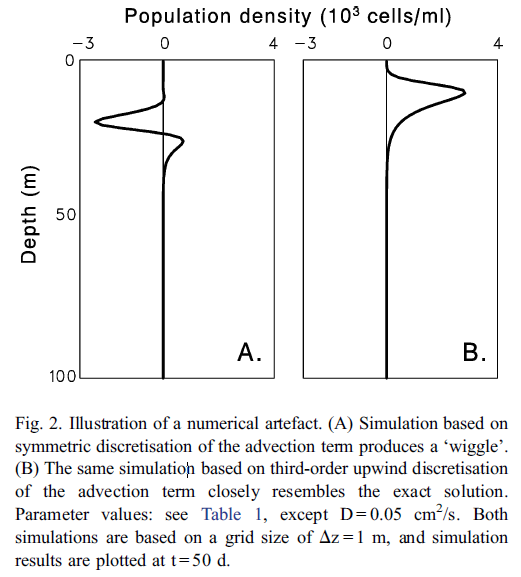
]

---

### 为什么我推荐这篇文章？

抛开数值模拟的方法而言，Chris将.boldred[博弈论分析引入]了双源限制的藻类垂向分布模型，非常巧妙的证明和描述了弱混合状态下水柱中三种垂向分布的形成因素（水体和环境的物理量等）。这是我看Huisman中没有做到的一些工作。

--

于我而言，Chris所构建的控制方程基本满足了对于确定水体垂向分布的数值模拟要求以及构建CIB模型时假设的先验条件。

譬如，发生藻华的弱混合水柱其垂向中部必然不会存在与表层相当的藻生物量（因为其必然是富营养化且受光限制的作用），.boldred[水华剖线的规律性在数值模拟中得到了证实]。

--

这篇文章让我克服了对数值模拟的恐惧，实际上一些简易的模型仍然可以自己手动搭建（.boldred[如果你感兴趣要不要也试着自己算一算例子中的扩散方程？真是太有趣了]）。

--

.center[

## [Algal Game 完]

]


---

class: center, middle, inverse

# Content

### Algal game

### .boldred[利用git实现版本控制]

### Markdown写作

### 开源项目

---

class: center, middle

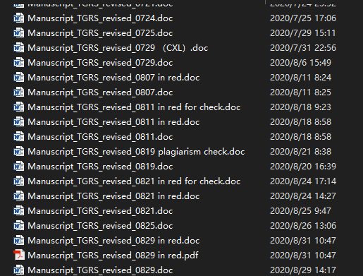

#### 被版本支配的恐惧？

#### 又或者常常认为现在的写的这一版比上一版写的还好？

#### 多人修改统一文件时混乱的时间线？

---

class: center, middle

# 那你为什么不试试用git？

---

## git是什么？

git是一个分布式.boldred[版本控制]软件

## 常用的git访问服务

.pull-left[

Github

.size-50[  ]

Google Code

.size-50[  ]

]

.pull-right[

SourceForge

.size-30[  ]

GitLab

.size-60[  ]

]


---

.center[
.size-75[


]]

.center[
Github的仓库页面：.boldred[Code, Issues, Pull requests, Wiki, Insights]
]

---

.center[
.size-85[


]]

.center[
所有的提交都会被记录在案，再也不用担心历史追溯的问题（甚至是错误）
]

---

.center[
.size-85[


]]

.center[
查看新旧文件的不同，并可以针对.boldred[所有修改细节]进行评述留言。
]

---

.center[
.size-85[


]]

### issue

对当前项目中存在的问题提出意见，类似于备忘录

如果在别人的仓库中发现问题也可以在issue中给出意见，一般比直接email的回应更迅速


---

.center[
.size-85[


]]


windows或mac系统中可以通过`Github Desktop`软件轻松实现仓库的创建、克隆、提交、比较等一系列操作。

同样也支持历史记录的查看，便于你控制当前仓库中所有资料的版本。


---

### Github是如何工作的？

初始化仓库，将文件与数据加载至工作路径

.center[

]

多终端与云端的同步（pull到本地，push到云端）


.center[
.size-65[


]]

---

### 线程、分支与合并

单线程历史管理

.center[

]

但实际上，任何一个项目都存在分岔路口。比如在某一个节点上的存在多种开发思路，或者是修复部分的内容，又或是对当前主线中做大部分修改的一个备份等等。

git中提供了分支（branch）的功能以满足上述的需求。

---

### 线程、分支与合并

在节点A初始化仓库，在节点B分化为三个分支用于不同的功能。

.center[

]

这些分叉出去的线程，有的最终被抛弃，有的最终被合并进主线（master）。需要向主线合并的分支需要向主线需要提交申请（merge request）。

---

### 线程、分支与合并

.center[

.size-60[


]]

分支的存在使得项目推进时不必遵循线性的操作过程，新增的需求可以跳过当前主线的进度直接向后推进，最终再与主线汇合；

同时，分支也能够保证在团队项目中能够明确合作者的分工内容。


---

### 注意事项

1. 本地化建立git仓库也需要备份文件；

2. 使用如GitHub服务端需要注意.boldred[公共]与.boldred[私有]仓库的区别；

3. 一定要在第一次初始化云端git仓库时确保.boldred[可忽略]的文件，一般在`.gitignore`中设置；

--

4. 可忽略的文件包括：本地关键数据、个人关键信息、容量较大的本地文件等；

5. 代码做云端git托管时记得ignore一些编译器中的临时变量文件，如`R`中的`.rData`文件（它会包括你上一次环境中运行的所有数据）；

6. 在你没有弄懂GitHub的工作之前，请尝试一些测试用的仓库或文件，.boldred[注意数据安全]；

--

7. 遵守License协议，在别人的仓库中确保你有完全或部分的权限使用别人的资料。

--

.center[

## 拥抱开源

]


---

### 参考资料

+ [git官网](https://git-scm.com/)

+ [连猴子都能动的Git入门指南](https://backlog.com/git-tutorial/tw/intro/intro1_1.html)

  - 本节主要图片的参考来源。

+ [这一次汇报的repo](https://github.com/bishun945/algalgames) 
    
  - 当然，这目前还是private的仓库，哈哈。

---

class: center, middle, inverse

# Content

### Algal game

### 利用git实现版本控制

### .boldred[Markdown写作]

### 开源项目

---

### 什么是markdown

markdown是一种轻量级标记语言，相比html更易读易写。

.smaller[

``` html
<!DOCTYPE html>
<html>
  <head>
    <meta charset="utf-8">
    <title>测试页面</title>
  </head>
  <body>
    <h1>Mozilla 酷毙了！</h1>
    
    <p>Mozilla 是一个全球社区，这里聚集着来自五湖四海的</p>
    <ul>
      <li>技术人员</li>
      <li>思考者</li>
      <li>建造者</li>
    </ul>
    <p>我们致力于让 Internet 保持活力，保持畅通，人人皆可贡献，人人皆可创造。我们坚信：开放平台的协作对于人的发展至关重要，也决定着我们共同的未来。</p>
    <p>为了达成我们共同的理想，我们遵循一系列的价值观和理念，请参阅 <a href="https://www.mozilla.org/zh-CN/about/manifesto/">Mozilla 宣言</a>。</p>
  </body>
</html>
```

]

---

从html语言翻译过来就是：


---

### 为什么用markdown写作？

.boldred[更少关注格式的问题，纯粹的专注于文字本身。]

拓展性强。`R`、`Python`、`Java`等等都支持`markdown`式的写作，即一边描述一边写代码。

以`Rmarkdown`为例，其有丰富的可支持转化格式，包括`word`、`html`、`pdf`、`pptx`等等。

--

`Rmarkdown`有多样化的模板，不仅仅是出稿件，更可以制作网页、幻灯片、app，甚至是写书。

我目前基于`bookdown`，`officedown`，`officer`和`flextable`等工具包进行毕业论文的写作。

2020年Rstudio全球论坛中Xie展示了[Magic of Rmarkdown](https://www.youtube.com/watch?v=qLEkUjxk7e8)：一份Rmarkdown文件，14种输出格式。

---

.pull-left[

### 一些基本语法

``` r
# 一级标题

## 二级标题

### 三级标题

+ 列表1

+ 列表2

  - 子列表

> 这是一段引文

这是一个**加粗**，这是一个*斜体*

用css给一个.red[红色]

这是一个简单的行内公式

$f(x) = \int_a^be^xdx$

```


]

.pull-right[

# 一级标题

## 二级标题

### 三级标题

+ 列表1
+ 列表2
  - 子列表

> 这是一段引文

这是一个**加粗**，这是一个*斜体*

用css给一个.red[红色]

这是一个简单的行内公式 $f(x) = \int_a^be^xdx$

]

---

## 帮助链接

+ [Markdown中文文档](https://markdown-zh.readthedocs.io/en/latest/)

+ [Rstudio Rmarkdown introduction](https://shiny.rstudio.com/articles/rmarkdown.html)

+ [How to build an interactive documents with `Shiny`](https://shiny.rstudio.com/articles/interactive-docs.html)

+ [An online latex editor](https://www.overleaf.com)

## 2020Rstudio大会

+ [Magic of Rmarkdown - Yihui Xie](https://www.youtube.com/watch?v=qLEkUjxk7e8)

+ [How Rmarkdown changed my life - Rob Hyndman](https://www.youtube.com/watch?v=_D-ux3MqGug)

---

class: center, middle, inverse

# Content

### Algal game

### 利用git实现版本控制

### Markdown写作

### .boldred[开源项目]

---

.center[
.size-90[

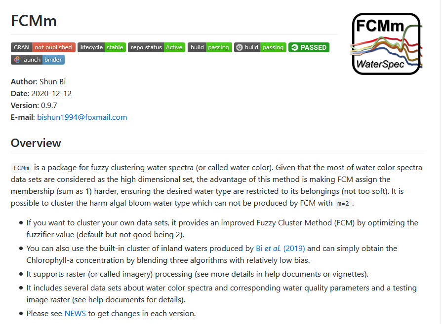

]]

[`FCMm`](https://github.com/bishun945/FCMm)除了做`光谱聚类`，它还包括了：`开源遥感数据集`、`SRF模拟`、`误差指标计算`、`Bootstrap算法评估`、`影像处理`和`Chla算法`等等。

---

.center[
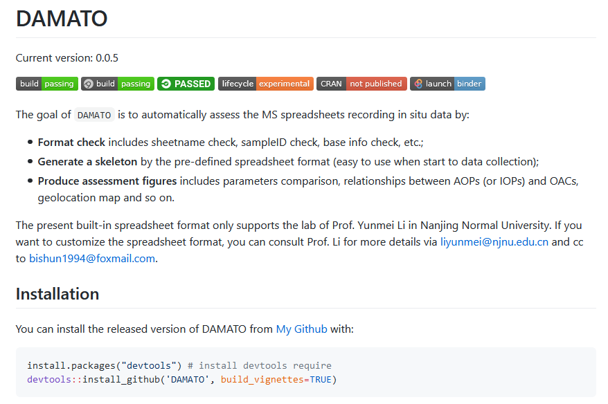
]

.boldred[DA]ta .boldred[MA]nagement .boldred[TO]olbox（[DAMATO](https://github.com/bishun945/DAMATO)）主要用于野外实测数据集质量的检控

---

.pull-left[

#### `DAMATO`(v0.0.7)支持的功能：

.small[

.boldred[检查类]

基本参数表检核 `Check_base_info`

经纬度记录的坐标检核 `Check_geo_location`

工作簿名称检核  `Check_sheet_name`

通用编号一致性检核 `Check_sample_id`


.boldred[初始化]

生成文件路径 `Generate_ref_folders`

生成Excel空白文件 `Generate_ref_spread`

]

<style>
.leaflet {
    margin: auto;
}
</style>

```{r echo=FALSE, fig.align="center"}
load("./figs/dt_lonlat.rData")
dt_lonlat <- FCMm::level_to_variable(dt_lonlat)
names(dt_lonlat) <- c("name", "lon", "lat")
library(leaflet)
m = leaflet(dt_lonlat, width=350, height=250) %>% addTiles()
m = m %>% setView(median(dt_lonlat$lon), median(dt_lonlat$lat), zoom=9)
label.opt <- labelOptions(noHide=F, textOnly=T, textsize="9px") 
m %<>% 
  addScaleBar() %>%
  addCircleMarkers(~lon, ~lat, label=~htmltools::htmlEscape(name), labelOptions=label.opt,
                   radius=2, opacity=0, fillOpacity=1, color="red")
m
```

]

.pull-right[

#### 当前开发和计划功能

.small[

.boldred[可视化]

基于`shinny`开发带dashboard的交互式检核app；

确定`rmarkdown`报告格式（输入检核完成的Excel，输出ppt或html报告）；

.boldred[数据格式]

定义野外数据专属的数据class；

人机交互式的质量标签（基于`shinny`交互）

]

```{r echo=FALSE, fig.align="center", message=FALSE, warning=FALSE}
library(FCMm)
library(plotly)
p = plot_spec_from_df(WaterSpec35[,-c(1, 2)]) + 
  labs(x="Wavelength [nm]", y="Rrs 1/sr")
ggplotly(p, width = 350, height=250)
```

]

---

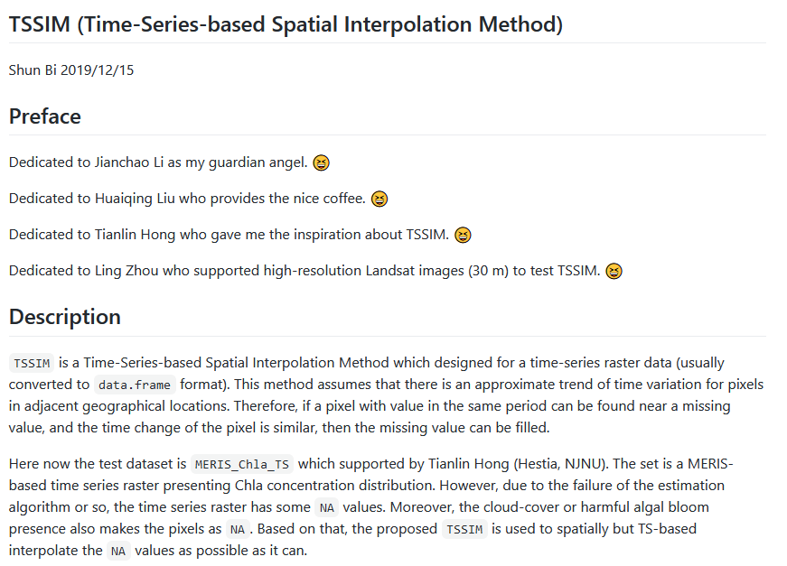

[`TSSIM`](https://github.com/bishun945/TSSIM)是针对时序栅格数据的.boldred[补缺]工具包。

---

.center[
### 基于最近邻时序线性关系的插补
]

.pull-left[

找出缺失值

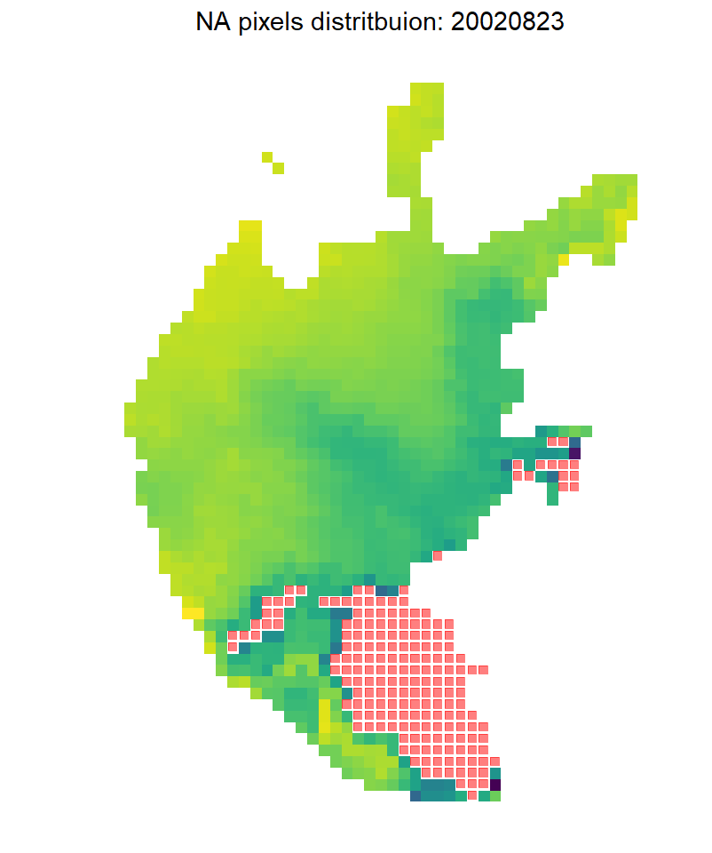

]

.pull-right[

逐次插补

<br>

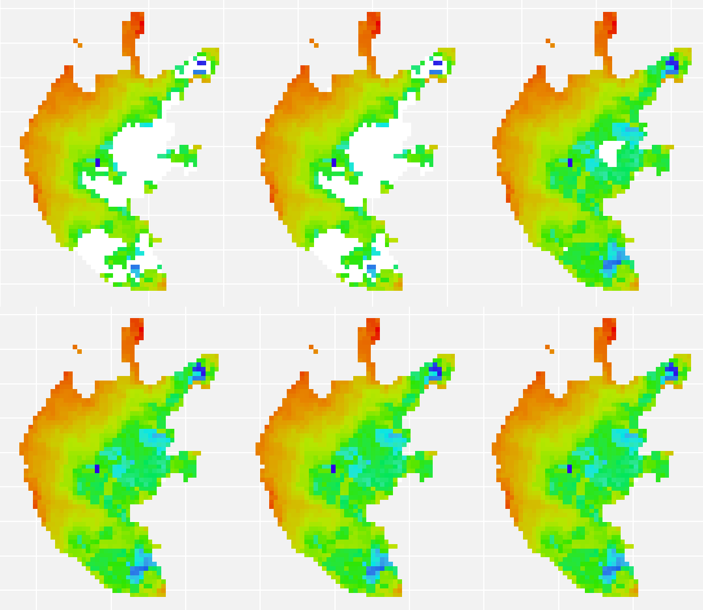

]

---

class: center

### 基于DINEOF的缺失值插补（推荐）

.size-80[
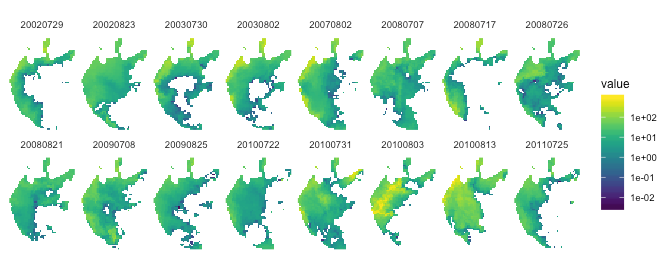
]

.size-80[
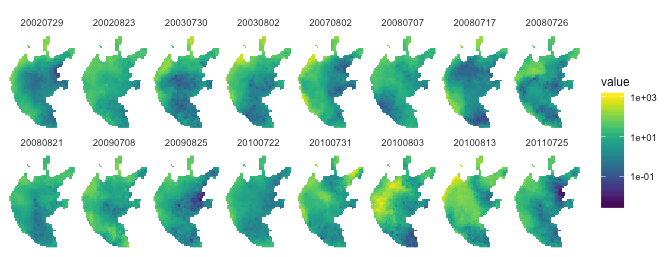
]

---

### [seadasr](https://github.com/bishun945/seadasr) (v0.0.0)

**简介**：在linux环境下调用seadas的`gpt.sh`与OCSSW的接口对影像数据进行大气校正等处理

**开发目的**：

+ 避免`IDL`的证书问题

+ 使用开源社区中更丰富多彩的工具（`IDL`过于古董）

+ 重新构建了工作路径的创建和刷新问题

+ 增加函数的复用

**主要函数**：

+ .boldred[下载影像] `download_goci_images`, `download_goci_images_range`, `download_goci_images_website`, `download_images`

+ .boldred[快视图生成] `get_quick_view`, `get_quick_view_loop`

+ .boldred[大气校正（子、主）函数] `get_subset_array`, `goci_ac_dw`, `modis_ac_dw`, `run_goci_seadas`, `run_modis_seadas`, `run_seadas`


---

### hdf_to_envi的替代方案

.smaller[

``` r
hdf_to_raster <- function(hdf, xml, work_dir) {

  if(!file.exists(xml))
    stop("xml file not found!")

* system(sprintf("gpt.sh %s -t %s/tmp.dim -Ssource=%s", xml, work_dir, hdf))

  img_files <- list.files(file.path(work_dir, "tmp.data"), pattern="*.img$",
                          full.names = TRUE, include.dirs = TRUE)

  return(data.frame(stringsAsFactors = FALSE,
                    img_files,
                    img_name = basename(img_files)))

  system(sprintf("rm %s/tmp.dim", work_dir))
  system(sprintf("rm -rf %s/tmp.data", work_dir))

}
```

]

---

### 增加函数复用

以DW算法为例，其包括`清洁水体确定` `气溶胶计算` `基于气溶胶计算水体遥感反射率`;

除`L0`文件读入存在差异（逐传感器编写），从`L1`至`L2`的`l2gen`处理基本一致，该过程可以写成泛型函数；

工作路径、临时路径、`L0`和`have_done`等文件夹初始化操作也可以复用。

### 栅格处理依赖

依赖于`raster`和`rgdal`工具包实现栅格数据处理，包括投影；

依赖于`ggplot2`等工具包实现可视化；

依赖于`leaflet`等工具包实现交互式地图检视。

---

### 计划更新（毕业论文写完之前不会做）

添加Sentinel-API下载SLSTR数据，实现ACbTC的大气校正；

基于`rgee`包筛选cloud-free影像ID，并下载；

转化刘阁最新AC方法。

---

# References

+ Klausmeier C A, Litchman E. Algal games: The vertical distribution of phytoplankton in poorly mixed water columns[J]. Limnology and Oceanography, 2001, 46(8): 1998-2007.

+ Huisman J, Sommeijer B. Population dynamics of sinking phytoplankton in light-limited environments: simulation techniques and critical parameters[J]. Journal of Sea Research, 2002, 48(2): 83-96.

+ Ji Z G. Hydrodynamics and Water Quality: Modeling Rivers[J]. Lakes, and Estuaries, 2008.

+ 翟瑞彩, 谢伟松. 数值分析[M]. 天津大学出版社, 2000.

+ [APC591 Tutorial 5: Numerical Solution of the Diffusion Equation](https://sites.me.ucsb.edu/~moehlis/APC591/tutorials/tutorial5/tutorial5.html)

+ Images mainly from [Google img](https://www.google.com.hk/imghp?hl=zh-CN&tab=wi&ogbl)

+ Icons from [FontAwesome](https://fontawesome.com/icons?d=gallery)

---

class: center, middle, inverse

.size-40[


]

--

## .large[提问时间]

